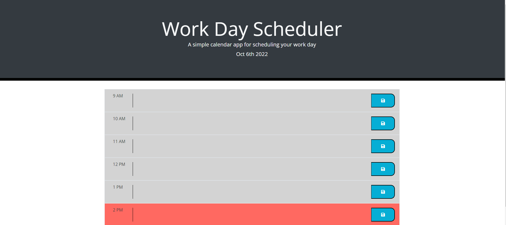

# Work Day Scheduler

## Description
This project was to make a schedule that you can save what needs to be done during your work hours. When you click the box you get to enter in text. Clicking the save button will save the text to local storage. Refreshing the page will grab the text from local storage and place it back on page. After the current time passes the time of the schedule block the color will change to gray. If it is the present hour the color will be red. Future time blocks will be green.
In this project i used HTML, CSS, JavaScript. I used the APIs from Jquery, Moment.js, Bootstrap, and googlefonts.

## Screenshots

## Deployed Website

[Work Day Scheduler](https://amassey42.github.io/work-day-scheduler/)